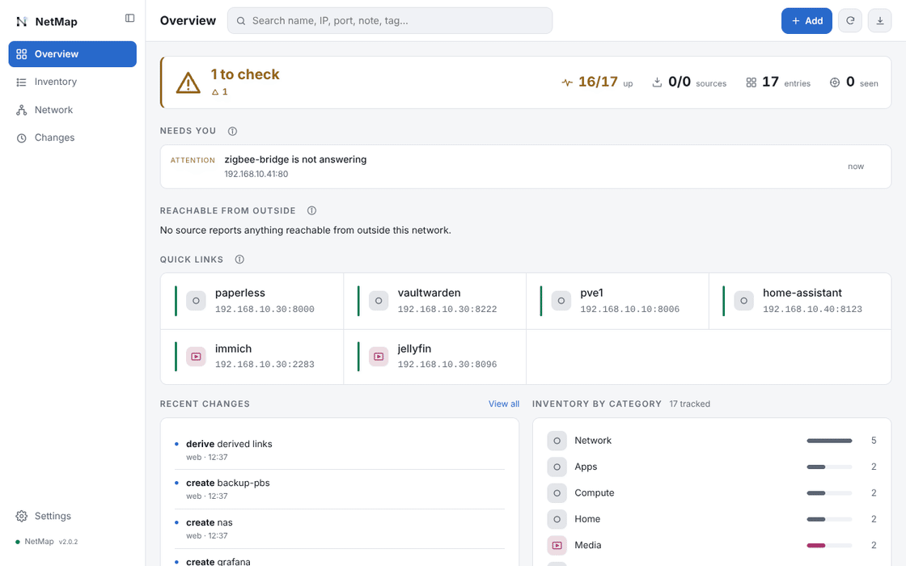
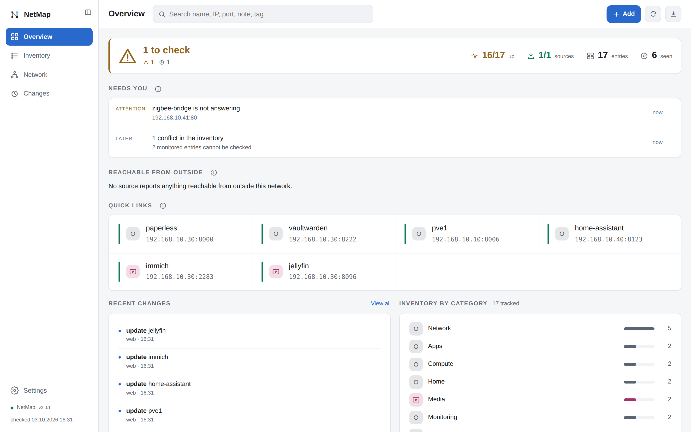
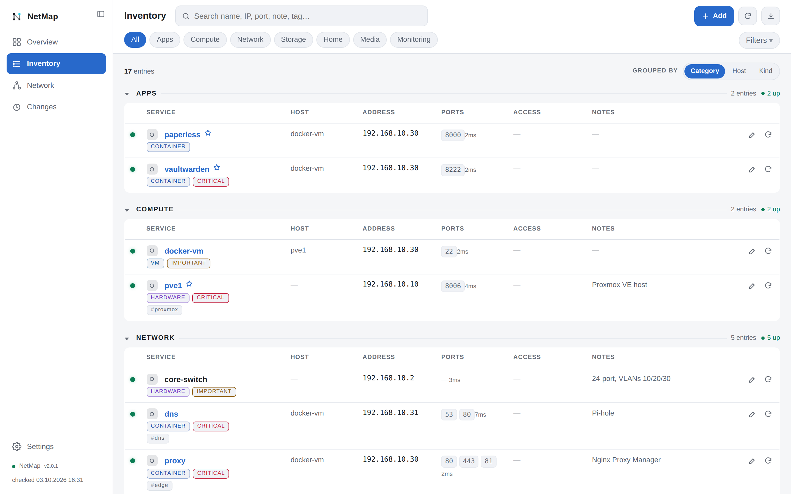
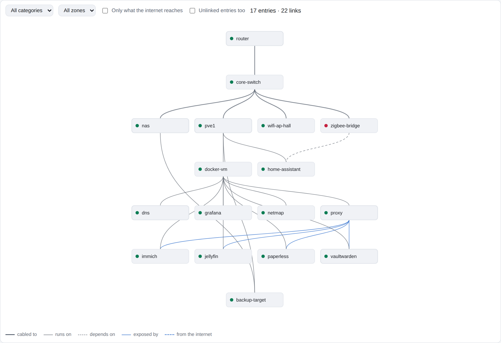
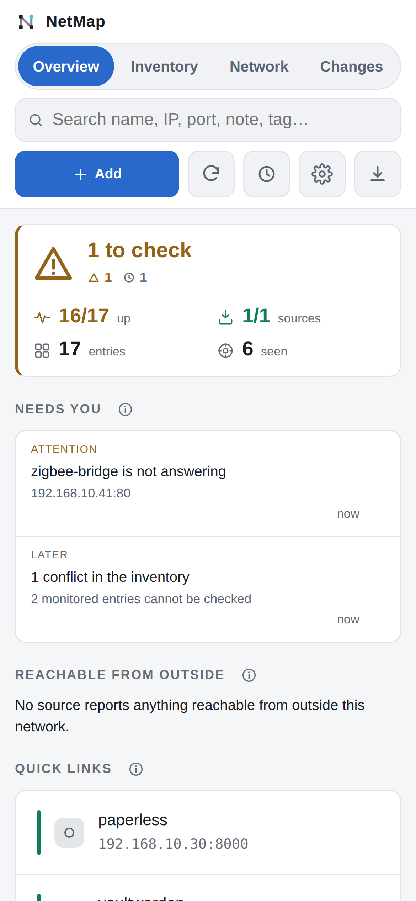

# NetMap

**A self-hosted inventory of your network that checks itself.** Write down
what runs where - hosts, VMs, containers, services, ports, addresses - and
NetMap compares it with what your infrastructure actually reports: Docker,
Proxmox, OPNsense, Pi-hole, AdGuard Home, UniFi, Home Assistant, Nginx Proxy
Manager, Traefik, Cloudflare, NetBox, DHCP leases, ARP over SNMP and an
open-port sweep. Where the two disagree, it says so; a person decides.

- **Inventory** you edit from a desktop or a phone, with live reachability,
  30-day uptime, relationships and a topology graph.
- **Reconciliation** against read-only sources: what is new, what is gone,
  what moved, which ports nobody declared, which hostnames are public without
  an access policy.
- **New on the network**: devices nobody has named yet - add them, ignore
  them, or watch them until you know.
- **Notifications** (ntfy, Gotify, Telegram, webhook), at once or as a daily
  or weekly summary.
- **MCP server**, so an AI assistant (Claude and others) can read and edit
  the same inventory.
- One container: FastAPI + SQLite, no external database, amd64 and arm64.

Every source is **read-only**: NetMap never changes your router, DNS, proxy or
containers. Credentials you add are encrypted at rest.



*A demo inventory with made-up names and addresses.*

<details>
<summary>More screenshots - overview, inventory, topology graph, phone</summary>

<picture>
  <source media="(prefers-color-scheme: dark)" srcset="docs/screenshots/overview-dark.png">
  
</picture>

<picture>
  <source media="(prefers-color-scheme: dark)" srcset="docs/screenshots/inventory-dark.png">
  
</picture>

<picture>
  <source media="(prefers-color-scheme: dark)" srcset="docs/screenshots/graph-dark.png">
  
</picture>



</details>

*The screenshots show a demo inventory with made-up names and addresses.*

| | |
|---|---|
| Web UI | `http://<server>:8087/` |
| REST API | `/api/…` |
| MCP endpoint | off until `NETMAP_MCP_TOKEN` is set; `/mcp` by default (streamable HTTP, section 10) |
| Health | `/healthz` |
| Storage | SQLite at `/data/netmap.db` |

---

## 1. Install

You need Docker with the Compose plugin. Put [`docker-compose.yml`](docker-compose.yml)
in a folder of its own, set `NETMAP_ALLOWED_HOSTS` to the address or name you
will open NetMap by, then:

```bash
mkdir data && sudo chown 1000:1000 data   # the app runs as UID 1000
docker compose up -d
docker compose logs netmap | grep password   # the one-time admin password
```

Open `http://<server>:8087/`, sign in as `admin` with that password, and set
your own under **Settings › Profile**. A new install starts with an **empty
inventory and no sources**: add entries with **+ Add** (or import a JSON
export), and sources under **Settings › Sources** (section 12 says which
read-only credential each one needs).

To start from an inventory kept elsewhere, set `NETMAP_SEED_FILE` to a JSON
export: it is loaded once, into an empty database only.

Building it yourself instead: `docker compose up -d --build` in a clone of
this repository (uncomment `build: .`).

### Update

`docker compose pull && docker compose up -d`. Everything lives in `./data`,
so an update never loses entries; the database migrates itself at start-up.
Pin a version tag (e.g. `:2.0.0`) to upgrade on your own
schedule. Settings › About shows what changed.

---

## 2. Remote access

NetMap listens on port 8087. Reach it from elsewhere however you already do
for other self-hosted apps:

- **On the LAN only** - the default; the local login protects it.
- **A reverse proxy** (Nginx Proxy Manager, Traefik, Caddy) - forward to
  `netmap:8087` (same Docker network) or `<server>:8087`, with WebSockets on.
  Bind the port to loopback (`127.0.0.1:8087:8087`) or drop it once the proxy
  is the only way in, and add the proxy's host name to `NETMAP_ALLOWED_HOSTS`.
- **Cloudflare Tunnel + Access** - route a hostname to
  `http://netmap:8087`, protect it with an Access application, and set
  `NETMAP_CF_ACCESS_TEAM` / `NETMAP_CF_ACCESS_AUD` so NetMap verifies the
  Access login itself (below).

### Authentication (1.69.0+)

Every request except `/healthz`, `/login` and `/static/…` must prove who it is -
being on the LAN is not an identity. Three ways, any one is enough:

- **Cloudflare Access JWT.** Access adds a signed `Cf-Access-Jwt-Assertion`
  header (and a `CF_Authorization` cookie) to every request it lets through.
  NetMap verifies the signature against your team's published keys, plus the
  audience, issuer and expiry. Set:
  - `NETMAP_CF_ACCESS_TEAM` - the `xxx` in `xxx.cloudflareaccess.com`
    (Zero Trust → Settings → Custom Pages shows the team domain)
  - `NETMAP_CF_ACCESS_AUD` - the netmap application's **Application Audience
    (AUD) Tag** (Access → Applications → netmap → Overview)

  The verified e-mail is what the change history records. The unsigned
  `Cf-Access-Authenticated-User-Email` header is no longer read - a header
  anyone can type is not proof that Access saw the request.
- **`NETMAP_API_TOKEN`** - `Authorization: Bearer <token>` for machines that
  cannot log in: a dashboard widget (section 9), backup scripts.
  Recorded in the change history as `api-token`.
- **Local password login** at `/login` - the way in without Cloudflare
  Access, and the spare key when Access is misconfigured. One account,
  username `admin` to start with, changeable along with the password under
  **Settings › Profile**. There is no default password in the code: the first
  start uses `NETMAP_ADMIN_PASSWORD` if set, otherwise generates one and prints
  it once to the container log (`docker logs netmap | grep "local login"`).
  Until it is changed, every page shows a banner saying so. Sessions are
  signed, HttpOnly, SameSite=Strict cookies valid for 14 days; changing the
  password signs out every other session. Five wrong attempts from one client
  (or twenty overall) in 15 minutes lock the password login for 15 minutes -
  Access and the API token keep working. Lost the password:
  `docker exec -it netmap python -m app.accounts reset` prints a new one.

A signed-out browser is sent to `/login`; API calls get 401. A state-changing
request authenticated by a cookie (Access or password) is refused if its
`Origin` names another site. `NETMAP_AUTH=off` turns all of this off for a local development copy; the
log and Settings › About both say so in capitals. The MCP endpoint is separate
and unaffected - it is off unless `NETMAP_MCP_TOKEN` is set, and then requires
that bearer token (section 10).

Requests whose `Host` is not in `NETMAP_ALLOWED_HOSTS` (port ignored) are
refused with 400 before any of this runs - that is what stops DNS rebinding,
where a page on another site re-points its own name at this address. The
refusal names the host and the setting to add it to.

---

## 3. Connect an AI assistant (MCP)

NetMap is an MCP server at `NETMAP_MCP_PATH` (default `/mcp`, streamable
HTTP). It is **off until you set `NETMAP_MCP_TOKEN`**, and then every request
needs that bearer token - section 10. Any MCP client that can send a bearer
token works: Claude (Desktop, Code, or claude.ai through a connector or an MCP
portal), and others.

### Tools Claude gets

| Tool | Purpose |
|---|---|
| `list_entries` | search / list the inventory |
| `get_entry` | one entry by id |
| `create_entry` | add a device or service |
| `update_entry` | change any field |
| `delete_entry` | remove an entry (kept in history) |
| `list_categories` | categories, tags, totals |
| `check_status` | live TCP reachability check |
| `get_service_context` | one entry in full: status, links, history, edits |
| `link_entries` / `unlink_entries` | record or remove a relationship |
| `derive_links` | infer relationships from the entries |
| `map_host` | teach it which entry a `host` string means |
| `get_topology` | the runs-on tree |
| `scan_docker` | compare running containers with the inventory |
| `scan_opnsense` | compare leases, reservations and NAT rules with the inventory |
| `scan_all_sources` | every configured source at once |
| `list_sources` | every added source - id, type, roles, answering or not - without scanning |
| `scan_source` | one source by id (`docker-2`, `adguard`, `traefik`…) |
| `ignore_finding` / `list_ignored` | suppress a discovery finding, and review what is suppressed |
| `find_conflicts` | contradictions in the inventory |
| `recent_changes` | audit log |

---

## 4. Data model

| Field | Meaning |
|---|---|
| `category` | Core Network, Docker, Smart Home, … |
| `name` | device or service name |
| `host` | VM / CT / physical host |
| `ip` | IPv4 or hostname |
| `mac` | one or more MAC addresses, normalised on write |
| `ports` | free text (`8443`, `80, 443, 81 (admin)`, `2211 → 22`) |
| `protocol` | HTTPS, SSH, MQTT, … |
| `url` | optional explicit link; otherwise built from `ip:port` |
| `tags` | free-form, clickable filters |
| `notes` | anything |
| `monitor` | include in reachability sweeps |
| `verified` | `false` shows an orange **verify** badge (the old yellow rows) |
| `criticality` | `critical` / `important` / `normal` / `experimental` |
| `zone` | network zone - LAN, IoT, DMZ, Management … |
| `secret_ref` | a **pointer** to credentials elsewhere, never a credential |

## 5. Status checks

A background sweep every `NETMAP_CHECK_INTERVAL` seconds (default 120) checks
each monitored entry. Green = answered, red = no answer, hollow = not monitored
or not probed. The dot's tooltip and the service card say what was checked and
what answered ("HTTPS 10.0.0.5:8443/health → 200 in 42 ms").

By default that is a TCP connect to the entry's first port. An open port is
not a working service, so an entry's **Health check** field can ask for more:

| Check | What it does |
|---|---|
| *(empty)* | TCP connect to the first port, as always |
| `tcp`, `tcp:22` | TCP connect, to the first port or the one given |
| `http`, `https` `[:<port>][/<path>][=<code>]` | a GET. With `=<code>` only that status is up; without it anything below 500 is. The port is the one given, else the URL's, else 80/443 |
| `ping` | one ICMP echo, for devices with no open port |
| `none` | monitored, but not probed |

- HTTP(S) connects to the entry's IP and names the URL's host (TLS SNI, the
  certificate check, the `Host` header), so a service behind a name-based
  proxy answers as itself. It follows no redirect: a 3xx is below 500, so up.
- `https` reads the certificate. One that does not verify (self-signed, wrong
  name) is shown as "TLS invalid" on the card, not as down. One expiring within
  21 days (Settings › Sources, 1–365) is an Overview warning and a `cert`
  notification; an expired one is critical.
- `ping` uses an unprivileged ICMP socket - the image has no `ping` binary and
  runs as a normal user. Docker allows these by default
  (`net.ipv4.ping_group_range`); where it is not allowed the check reports
  "not permitted", as unknown rather than down.
- A transition stores what was checked in `observations.detail`.

**Stale entries.** NetMap records when something last confirmed each entry
exists: a source's sighting (not a port found closed, not NetBox's plan), an
address a source sees at the entry's MAC - or, for hardware and VMs, at its
address - or its health check answering. The service card shows it ("Last
seen"). An entry that *was* confirmed and then nothing has confirmed for
14 days (Settings › Sources, 1–365) is listed in one Overview note, each
name a chip that opens its card. Entries never confirmed are never listed -
nothing says a source could see them - and neither are those a source
already reports gone (Docker's "no container", a stale NAT rule, a missing
tunnel route or Home Assistant entity). On the first start, an entry whose
health check went down and never came back counts as last seen when it went
down.

**Uptime.** The service card shows the share of the last 30 days an entry's
check answered ("99.58% up over 30 days · down 3h in all") with a strip of
up, down and unknown periods; the status dot's tooltip carries the figure.
It is computed from the stored transitions, so it costs nothing to collect.
Unknown is never counted as up: time an entry was not monitored, time before
its first record (the card then says "since …"), and time NetMap itself was
not running - every sweep leaves a heartbeat, and a silence of more than two
sweep intervals found at start-up is kept as a gap. Where it is shown:
Settings › Sources, by criticality (default critical and important), kind
or category; a tag `uptime:on` / `uptime:off` on an entry overrides the rule.
This is a lightweight complement to Uptime Kuma, not a replacement: a
critical or important entry going down can be notified (5b), but there are no
thresholds, retries or escalation.

## 5b. Notifications

**Settings › Notifications** sends what the Overview would show to somewhere
you will see it when NetMap is not open. It detects nothing new; it delivers.

| Channel | Needs | Notes |
|---|---|---|
| ntfy | server (default `https://ntfy.sh`), topic, optional access token | JSON publish to the server root; urgent items get priority 4 |
| Gotify | server, application token | `POST /message`; urgent items get priority 8 |
| Telegram | bot token (from @BotFather), chat id, optional forum topic id | plain text, so `_` and `*` in names arrive intact. Message the bot once, then read the chat id from `https://api.telegram.org/bot<token>/getUpdates`. "Bot API server" is for a self-hosted Bot API |
| Webhook | URL, optional bearer token | `POST` JSON `{kind, key, title, detail, url, ts, level, version}` - point it at an Apprise API container for anything else |

Each channel chooses its events:

- **finding** - a finding a source did not report on its previous scan (ignored ones never)
- **entry** - a monitored entry with criticality `critical` or `important` stops answering, or answers again
- **source** - a source stops answering, or answers again
- **cert** - a certificate an `https` health check reads expires soon, or has expired (5)
- **critical** - any other critical Overview item (e.g. stored secrets no key can open)

Rules:

- **Once per change, never once per scan.** What is wrong now is compared with
  what was wrong last time (kept in the `kv` row `notify_state`). A finding that
  clears and comes back later is new again.
- **Restarts are silent.** That state survives a restart, so only what changed
  meanwhile is sent. The first scan of a newly added source, and the first run
  after upgrading, record what is already true without sending it.
- **Rate limit.** At most N messages per channel per 10 minutes (a field,
  default 10). The rest collapse into one "and N more"; anything over the
  limit waits for the window, it is not dropped - editing the channel keeps
  it too. Only a restart in that window loses it (it is held in memory).
- **Failures stay local.** A delivery that fails is logged and shown in red on
  the channel's row; it never interrupts the scan or sweep that caused it.
  *Test* sends one message at once, outside the rate limit.
- **Secrets as for sources.** Tokens, and the webhook URL itself (Slack and
  Discord put the token in it), are encrypted with the source secrets' key
  and shown only as a last-four preview (nothing at all for one under 16
  characters). A blank field on save keeps the
  stored value. Changing a server address, or the webhook URL, needs the
  token typed again.
- "Link back to NetMap" (optional) adds a link to your NetMap in each message.

**Summaries (1.92.0).** A channel's *Delivery* is *Immediately* by default.
Set it to *Daily summary* or *Weekly summary* and everything it would have
sent waits (kv `digest_held:<channel>`, so a restart loses nothing) and goes
as one message at the chosen hour - and day, for weekly - grouped by event.
Nothing waiting, no message. Urgent events still go at once: at critical
level, of the kinds ticked under "Send at once even in a summary" (default
all four: a critical entry down, a source not answering, an expired
certificate, any other critical item) - and so does the all-clear for one. The hour is local to the time zone
under the channel list (default the container's `TZ`, else UTC). Switching
back to *Immediately* sends what was waiting straight away.

## 6. The three views

**Overview** is the landing view. It opens with the status strip: when
nothing needs you, one row - "All clear - nothing needs you" - with the
numbers (monitored entries up, sources fresh, entries and how many of them
could have a health check and have none, sightings); otherwise "*N* things
need you" and the queue, worst first in the order the server ranks it (a dead
source above what it would have reported). Each row has its rank, a type
(source, down, certificate, exposure, mismatch, conflict, coverage, verify),
when it started, an action (Retry scan, Open entry, Accept, Review, *Mark all
verified*) and **Snooze**; snoozed rows sit behind "*N* snoozed" and come back
when the situation changes. Below it come **Hardware & blast radius** (one
tile per physical host that something runs on: how many entries depend on it
through `runs_on`, VMs and containers included, how many of those a health
check watches, and amber notes when two systems the network leans on -
firewall, DNS, proxy, edge, read from where each source's URL points - share
the host, when three or more critical entries depend on it, or when it is
tagged `backup:none`; plus the network gear, up out of monitored), an
inventory-by-category breakdown with each category's monitored share (solid)
inside its total (faint), **Quick launch** (pinned services by name, each a
link with its URL's host name - ip:port when it has no URL - and its status,
plus up to two critical entries with a URL worth pinning, one click each), and
**Changes**: the change log and status changes grouped by day, a run of
changes by one actor to one entry (or to entries on one address) within two
hours folded into one row that opens, with All / Discovered / Edits / State
filters and the six newest groups. The numbers and
the breakdown always describe the whole inventory, never the current filter.
Clicking a category jumps to Inventory filtered to it. **Customize overview**
at the bottom of the page shows, hides and reorders the cards below the status;
the layout is stored on the server, one for the instance. The status strip is
always shown, first.

The header says when the sources were last scanned and when the next automatic
scan is due ("Scanned 12:15 · next in 40 min").

**Inventory** is the editable table (cards on a phone), grouped by category with
a per-group health summary in each heading.

**Network** is the map: topology, address usage and port usage.

The chosen view is remembered per browser; typing in the search box switches to
Inventory automatically.

**Refreshing is quiet.** The page re-reads every 60 seconds, but it compares a
signature of what it is showing - each entry's id, `updated_at` and up/down
state, plus the conflict count - and repaints nothing when that has not moved.
Latency figures are deliberately excluded, so normal jitter does not cause a
repaint. A hidden tab does not poll at all, and returning to the tab refreshes
immediately rather than waiting out the interval.

### Kind - what a thing *is*

Categories say what an entry **does**, `host` says **where it runs**, and `kind`
says what it **is**: `hardware`, `vm`, `container`, `service`, `rule`. Three
independent axes, so a Pi-hole in an LXC that serves DNS is
category *Core Network* / host *LXC* / kind *container* with no conflict.
Kinds appear as filter chips and as a badge on each row.

### Settings

The gear button opens Settings: a **theme** switch (Auto / Light / Dark - Auto
follows the OS, and an explicit choice is remembered per browser) and an
**About** panel showing version, counts, conflicts, last status sweep, check
interval, uptime, database size and path, and whether the MCP endpoint is on
or off. About never reveals the MCP path.
A **Data** panel exports and imports the inventory (section 11).

Explanations of how something works sit behind an **ⓘ** next to what they
explain - hover or focus on a desktop, tap on a phone, Esc or a tap elsewhere
closes. What the page *reports* (counts, states, errors) stays visible. Every
source and notification channel has an **Enabled** switch at the top of its
form; off pauses it and keeps its settings and secrets.

**A tab that has not refreshed** for more than two minutes - a laptop that
slept, a server that stopped answering - greys every status colour and says
"Not refreshed since …" until fresh data arrives; it asks for it at once.
On the Network page each source is its product's mark with a status bar under
it (the name and last answer are in the tooltip); a source with no mark gets a
drawn glyph. Source colours are re-checked against the clock every 15 seconds: amber means
the source's last good answer is older than **5 hours** - a setting under
Settings › Sources (1–720), next to the scan interval.

### Quick links

Tick **Pin to Quick links** on any entry to put it on the Overview. Over MCP,
pass `pinned: true` to `create_entry` / `update_entry`. Nothing is pinned by
default - the section explains itself until you pin something.

### Conflicts

The Overview grows a **Conflicts** section whenever the inventory contradicts
itself. Five rules, all deliberately narrow - a detector that cries wolf gets
ignored:

| Rule | Severity | What it means |
|---|---|---|
| `port-clash` | high | one `ip:port` claimed by two entries |
| `address-clash` | high | two entries of kind *hardware* or *vm* on one IP |
| `duplicate-name` | review | the same name used twice |
| `duplicate-url` | review | two entries pointing at one URL |
| `unprobeable` | review | monitoring is on but there is nothing to probe |

Things that are normal on a home network are **not** conflicts: twenty containers
sharing their host's IP, or a port-forward naming a service that already
exists (rules are excluded by `kind`, by the `port-forward` tag, or by a name
beginning "Port forward"). To silence a deliberate pair, tag either entry
`dup-ok`. Claude sees the same list through the `find_conflicts` tool.

### Grouping

Inventory groups by **Category**, **Host** or **Kind** - the segmented control
sits above the first group heading, not among the filter chips: the chips
change *which rows you see*, the toggle changes *how those rows are arranged*,
and putting a fixed control beside a horizontally scrolling list guarantees a
half-clipped pill at the boundary. The choice is remembered per browser. The table's second column shows whichever axis you are *not* grouping
by, so grouping by host puts Category there instead of repeating the heading.

### Relationships

Entries can be linked: `runs_on`, `depends_on`, `exposed_by`, `connects_to`,
`resolves_to`, `backs_up_to`. `src` is the subject - *Plex runs_on NAS*.
Links are what make "what would break if I stop this" answerable, and they are
the backbone of the Network view.

**Most of them are derived, not typed.** *Re-derive links* on the Network view
reads the entries and infers what it can:

| Source | Becomes |
|---|---|
| `host` | `runs_on` the matching entry |
| a public URL the tunnel routes | `exposed_by` the Cloudflare Tunnel |
| a port-forward rule at the same `ip:port` | `exposed_by` that rule |

Derived links are marked `auto` and rebuilt on every derive; **links you added
by hand are never touched**. It refuses to guess: an ambiguous match produces
nothing, because a wrong edge in a dependency graph is worse than a missing one.
It also does not derive "everything depends on DNS" - true, useless, and it
would bury the real edges.

**The host map.** `host` is free text - "VM 101", "CT 107", "HA add-on" - and
matches no entry's name, so nothing can bridge it automatically. The Network
view lists each distinct unmatched string once and asks which entry it means.
One answer places every entry that uses it: mapping one Proxmox VM can turn twenty
rows into a tree. Claude can do the same with `map_host`.

### The service card

Clicking any row opens it: status and address, links in both directions
(**Upstream** - what this needs; **Downstream** - what needs this, with
anything currently down flagged red), a form to add a link, the entry's own
up/down history, and its recent edits. It is also what `⌘K` opens for an entry
with no URL, and what Claude reads through `get_service_context`.

### Topology graph

Network › Topology › **Graph** draws every entry and link at once, in plain
SVG: an **Internet** node on top, joined by dotted lines to whatever a public
hostname (any `edge` source) or a forwarded WAN port (any `firewall` source)
reaches; then hardware, VMs, containers and services, each layer ordered to
keep links from crossing. Within a kind, what a node hangs off sits a row
above it - the switch above what is cabled to it, a proxy above what it
exposes. Point at a node to light up its links; click it for its card.
Filters: category, zone, only what the internet reaches, and entries without
links (hidden by default). They are remembered per browser. Below 640 px the
tab shows the tree instead.

### Network view

Third tab. Three things:

- **Topology** - the runs-on tree, roots first, with everything not yet placed
  listed underneath so nothing hides
- **Addresses** - one cell per host address in each /24, so a cell's position
  *is* its last octet. Red means two entries claim it
- **Ports** - ports used by more than one entry first (that is where the
  questions are), the single-use long tail as chips

### Status history

Reachability transitions are recorded in the database - only transitions, so a
row means "this changed", not "we looked". The in-memory cache is empty after a
restart, so the first check compares against the last stored row instead;
otherwise every restart would log sixty false changes.

## 6b. UI shortcuts

- `⌘/Ctrl + K` quick open - type a few letters, `↵` opens the service in a new
  tab, `⌘/Ctrl + ↵` opens it for editing. Matches names, initials (`ha` →
  Home Assistant, `npm` → Nginx Proxy Manager), IPs, ports, hosts and tags.
- `/` focus search
- `Esc` close dialog
- `⌘/Ctrl + Enter` save entry
- click a tag to filter by it, or a category name on the Overview
- CSV button exports everything

## 7. Environment variables

| Var | Default | Meaning |
|---|---|---|
| `NETMAP_DB` | `/data/netmap.db` | SQLite path |
| `NETMAP_CHECK_INTERVAL` | `120` | seconds between sweeps |
| `NETMAP_CHECK_TIMEOUT` | `2.5` | seconds per TCP probe |
| `NETMAP_MCP_PATH` | `/mcp` | MCP endpoint path (see section 10) |
| `NETMAP_MCP_TOKEN` | *(empty)* | bearer token required on that path; empty means the MCP endpoint is off |
| `NETMAP_ALLOWED_HOSTS` | *(empty)* | every name or address NetMap is opened by (localhost is implicit) - web UI, API and MCP |
| `NETMAP_CF_ACCESS_TEAM` | *(empty)* | Cloudflare Access team name; with the AUD, enables JWT login |
| `NETMAP_CF_ACCESS_AUD` | *(empty)* | the Access application's AUD tag |
| `NETMAP_API_TOKEN` | *(empty)* | bearer token with full API access, for scripts |
| `NETMAP_SECRET_KEY` | *(empty)* | Fernet key for stored source secrets. Set it and the key leaves the database: existing secrets are re-encrypted at start-up and the stored key deleted. Keep a copy - without it, stored secrets must be re-entered |
| `NETMAP_SUMMARY_TOKEN` | *(empty)* | read-only bearer token for `GET /api/summary` only - dashboard widgets |
| `NETMAP_METRICS_TOKEN` | *(empty)* | read-only bearer token for `GET /metrics` only - a Prometheus scraper (9b) |
| `NETMAP_ADMIN_PASSWORD` | *(empty)* | starting password of the local login, first start only; empty = generated and logged |
| `NETMAP_AUTH` | *(on)* | `off` disables authentication - development only |
| `NETMAP_DISCOVERY_INTERVAL` | `86400` | default seconds between automatic source scans; Settings › Sources overrides it |
| `NETMAP_SEED_FILE` | *(empty)* | a JSON export loaded once into an empty database; a new install otherwise starts empty |

### Sources are not configured here

Every source is added, edited and removed in **Settings › Sources**, and
stored in the database with its secrets encrypted (see `NETMAP_SECRET_KEY`).
A fresh install starts with none.

### About `NETMAP_ALLOWED_HOSTS`

Both halves of the app enforce DNS-rebinding protection. The MCP SDK answers
**HTTP 421 "Invalid Host header"** to any `Host` it does not recognise, and
since 1.69.0 the web UI and REST API answer **400** the same way (comparing the
name only, without the port). This is what stops a malicious web page from
making a visitor's browser talk to this server on your LAN. Only localhost is
trusted out of the box, so list every other name this server is reached by -
the public hostname, and the container name other containers use:

```yaml
- NETMAP_ALLOWED_HOSTS=192.168.1.50,netmap.example.org,netmap:8087
```

`localhost` and `127.0.0.1` (with any port) are always allowed and need not be
listed. Setting the value to `*` disables the check entirely - don't, unless
you have a specific reason. Requests carrying any `Origin` header are refused
with 403 by design: cross-origin browser traffic has no business here.

The startup log prints the accepted list, so `docker compose logs netmap` tells
you what it will honour.

## 7b. Brand

`app/static/brand/` holds the mark: `netmap-tile-{16,32,180,512}.png`,
`netmap-glyph.svg` (dark ink, for light backgrounds) and
`netmap-glyph-adaptive.svg` (structure inherits `currentColor`, so it works on
a dark app header and a white README; only the live node keeps a fixed cyan).

The mark appears in three places: the browser tab (favicon, inlined in
`index.html` as a data URI so it costs no request), the header next to the
wordmark (adaptive glyph - it inherits the header text colour, so it inverts
with the theme), and the Settings sheet (the dark tile, since that *is* the app
icon, shown at 44px above the version line).
Colours: tile `#12161B`, nodes `#E4E8ED`, connector `#6B7480`, live node
`#22D3EE`. Cyan deliberately avoids `#3DDC97`, which means *reachable* in the
UI, and `#5B9DFF`, which is the UI accent.

## 8. Files

```
netmap/
├── docker-compose.yml
├── Dockerfile
├── requirements.txt
├── README.md
└── app/
    ├── main.py        FastAPI routes + MCP tools
    ├── db.py          SQLite layer + audit log + JSON import/export
    ├── conflicts.py   inventory contradiction rules
    ├── links.py       relationship derivation
    ├── discovery.py   front door to the source registry
    ├── sources/
    │   ├── __init__.py   instances, scans, seed-once migration, by_role()
    │   ├── dynamic.py    the driver catalog and the roles
    │   ├── fields.py     the settings-form schema every driver declares
    │   ├── _dns.py       local-record checks shared by every DNS driver
    │   ├── _proxy.py     route checks shared by every reverse-proxy driver
    │   ├── _leases.py    address/MAC checks shared by every leases driver
    │   ├── docker.py, proxmox.py                 containers, virtualisation
    │   ├── opnsense.py                           firewall & DHCP
    │   ├── pihole.py, adguard.py                 DNS
    │   ├── npm.py, traefik.py                    reverse proxy
    │   ├── cloudflare.py                         public edge
    │   ├── unifi.py                              switches & Wi-Fi
    │   ├── homeassistant.py                      health
    │   ├── leasefile.py, snmparp.py              leases & ARP
    │   ├── netbox.py                             source of truth
    │   └── portscan.py                           port scan
    ├── status.py      reachability sweeps
    ├── notify.py      notifications - what is news, and delivery (5b)
    ├── newdevices.py  new on the network: device history and `new-device` (12l)
    ├── watch.py       devices kept in sight without an entry (12l)
    ├── fingerprint.py, fingerprints.json   what answers on an open port (12h)
    ├── oui.py, oui.txt.gz   MAC vendors (IEEE MA-L), refreshed by scripts/update_oui.py
    └── static/        index.html, style.css, and js/ - plain scripts loaded
                       in order (see tests/test_frontend.py for the one rule)
```

---

## 9. Dashboard widget (optional)

`/api/summary` returns compact counters, e.g. for a
[Homepage](https://gethomepage.dev/widgets/services/customapi/) customapi
widget. A dashboard on the same Docker network reaches NetMap by container
name - add `netmap:8087` to `NETMAP_ALLOWED_HOSTS`. It authenticates with `NETMAP_SUMMARY_TOKEN`, which
opens this one endpoint read-only and nothing else, passed to Homepage as the
`HOMEPAGE_VAR_NETMAP_TOKEN` environment variable so it is not written into
`services.yaml`:

```json
{"total":76,"up":45,"down":0,"monitored":45,"unverified":0,"findings":0,
 "conflicts":0,"critical_down":0, ...}
```

In `services.yaml`:

```yaml
- Infrastructure:
    - NetMap:
        icon: mdi-lan
        href: https://netmap.example.org/
        description: IP & port inventory
        widget:
          type: customapi
          url: http://netmap:8087/api/summary
          headers:
            Authorization: Bearer {{HOMEPAGE_VAR_NETMAP_TOKEN}}
          refreshInterval: 60000
          mappings:
            - field: total
              label: Entries
              format: number
            - field: up
              label: Up
              format: number
            - field: down
              label: Down
              format: number
            - field: findings
              label: Findings
              format: number
```

---

## 9b. Prometheus metrics (optional)

`GET /metrics` returns NetMap's state in the Prometheus text format, for
Grafana dashboards or Alertmanager rules - NetMap itself does not grow an
alerting engine. It reads what the status sweep and the source scans already
hold, so a scrape never probes or scans anything.

It sits behind the same authentication as the API. Give the scraper
`NETMAP_METRICS_TOKEN`, which opens `/metrics` and nothing else (the API token
would also work, but it can change the inventory):

```yaml
scrape_configs:
  - job_name: netmap
    metrics_path: /metrics
    authorization: {credentials_file: /etc/prometheus/netmap-token}
    static_configs: [{targets: ["netmap:8087"]}]
```

| Series | Labels | Value |
|---|---|---|
| `netmap_entry_up` | `id, entry, category, criticality, check` | 1 answered, 0 not, NaN not checked - monitored entries only |
| `netmap_entry_latency_ms` | `id, entry` | the last successful check |
| `netmap_cert_expiry_timestamp_seconds` | `id, entry` | from `https` health checks (5) |
| `netmap_source_up` | `source, type` | 1 last scan worked, 0 failed, NaN not scanned yet |
| `netmap_source_last_scan_timestamp_seconds` | `source` | last attempt |
| `netmap_source_last_success_timestamp_seconds` | `source` | last scan that worked |
| `netmap_findings` | `source, type` | findings of the last scan, by type |
| `netmap_source_findings` | `source` | all findings of the last scan; absent while the source is failing - unknown is not zero |
| `netmap_build_info` | `version` | 1 |

`id` is there because two entries can share a name. Label values are escaped,
so any entry name is safe. Example rules: `netmap_entry_up{criticality="critical"} == 0`,
`time() - netmap_source_last_success_timestamp_seconds > 2 * 86400`,
`netmap_cert_expiry_timestamp_seconds - time() < 14 * 86400`.

## 10. MCP endpoint

NetMap serves MCP (streamable HTTP) at `NETMAP_MCP_PATH`. The web login
(section 2) does not apply to this path; the MCP endpoint has its own guard,
and it is **off by default**:

- **`NETMAP_MCP_TOKEN`** - turns the endpoint on. Every request on the path
  must carry `Authorization: Bearer <token>`; anything else gets 401. Without
  it, the path answers `503 MCP is off: set NETMAP_MCP_TOKEN to enable it` and
  nothing reaches the MCP server - the toolset includes `delete_entry`. There
  is no other way to switch it on. Generate one:
  `python3 -c "import secrets; print(secrets.token_urlsafe(32))"`
- **`NETMAP_MCP_PATH`** - the endpoint path, `/mcp` by default. A private
  path keeps the endpoint out of casual scans, but it is not a credential: it
  travels in URLs (logs, history, screenshots). Optional:
  `python3 -c "import secrets; print('/private_' + secrets.token_urlsafe(18))"`

Point any MCP client that can send a header at
`https://<your host><NETMAP_MCP_PATH>` with that bearer token. Exposed to the
internet, put it behind something that authenticates first - for example a
Cloudflare Access application on the path with **Service Auth** (never
**Bypass**), or an MCP gateway/portal that signs the person in and forwards
calls.

**Rotating the path or the token:** change it in `docker-compose.yml`, run
`docker compose up -d`, then update every client that uses it.

The health endpoint does not report the path, and Settings › About only says
whether the endpoint is on or off. With a token set, the start-up log prints
the path; without one it says `MCP endpoint off - NETMAP_MCP_TOKEN not set`.

---

## 11. Backup and restore (JSON)

CSV is a one-way export - it drops kinds, flags and pins. JSON round-trips.

```bash
# on the server itself; the token is NETMAP_API_TOKEN
H="Authorization: Bearer $NETMAP_API_TOKEN"
curl -sO -H "$H" http://127.0.0.1:8087/api/export.json          # backup
curl -s -X POST -H "$H" -H 'content-type: application/json' \
     --data-binary @netmap-export.json \
     'http://127.0.0.1:8087/api/import?dry_run=true'    # preview a restore
```

Settings → **Data** does the same thing with a file picker and shows the plan
before anything is written.

- **Matching**: by `id` when that id still exists here, otherwise by name
  (case-insensitive). A name matching several entries is reported, never
  guessed at.
- **merge** (default) creates what is missing and updates what differs.
  It never deletes.
- **replace** additionally deletes entries the file does not contain - the UI
  asks for confirmation and names them first.
- `dry_run=true` is the default on the API: nothing is written and the plan
  comes back. Pass `dry_run=false` to commit.
- Every created, updated and deleted row goes through the normal audit log, so
  a restore is as reviewable as a hand edit.

The export also carries **edges and the host map**, and the import restores
them after the entries exist, resolving each end by id and falling back to the
name. Without that a restore would bring back the inventory and silently lose
the relationships, which are the part you cannot retype from memory.

Re-importing an unmodified export is a no-op - all entries report unchanged.

---

## 12. Discovery

NetMap can compare itself against the systems that actually know - what is
running, what holds an address, what is exposed, what resolves where. None of
them is written to. A scan returns findings; a person decides.

A source is added in **Settings › Sources**: pick a type, fill in its form,
*Test connection*, save. No redeploy, and nothing in `docker-compose.yml`. The
"Wiring it up" parts below show each type's fields as the `NETMAP_*` variables
that seed them once on upgrade (see §7); on a new install, type the same
values into the form.

Each type is a driver in `app/sources/`, listed in `app/sources/dynamic.py`:
a `FIELDS` list (the form), `configured(cfg)`, `scan(cfg)` and optionally
`test(cfg)`. `cfg` is the instance's saved values plus its decrypted secrets,
typed, plus a `_state` dict for login sessions that is dropped whenever the
instance is edited, and the instance's `_id` and `_key`.

A type can be added more than once - two Docker hosts, a primary and a
secondary Pi-hole, two tunnels - except **Open ports** (one sweep covers the
inventory) and **Proxmox VE** (entries name guests by vmid, which two clusters
can share). The first source of a type has the type as its id (`pihole`);
the next ones are `pihole-2`, `pihole-3`. Finding keys start with the same
id, so ignoring a finding from one Pi-hole does not ignore it on the other -
except the first source of each type, which keeps the prefix it always had
(`ha:` for Home Assistant). When a source says an entry is *missing* - a Pi-hole
group client, a Home Assistant entity, a tunnel route, a port-forward rule -
and another source of the same type sees that entry, the finding is dropped
and counted as `shadowed`: each one only sees its own half. Removing a source
removes what it saw; ignores stay.

Every driver declares its **roles** - what it is to the rest of NetMap:

| Role | Today | The contract |
|---|---|---|
| `containers` | Docker | sightings `container`, `port:<n>` = published |
| `hypervisor` | Proxmox VE | VMs and containers a hypervisor runs |
| `firewall` | OPNsense | sightings `port:<n>` = forwarded from the WAN |
| `dns` | Pi-hole, AdGuard Home | `dns_names(cfg)` - names with a local record |
| `proxy` | NPM, Traefik | `domains(cfg)` - names it serves |
| `edge` | Cloudflare | sightings `hostname:<name>` = published; key `<prefix>:access:<name>` when nothing is in front; optional `gateway(cfg, entries)` - the entry services are `exposed_by` |
| `layer2` | UniFi | `topology(cfg)` - what is plugged into what |
| `health` | Home Assistant | whether watched things work |
| `scanner` | Open ports | sightings `port:<n>` = open/closed; `skip_categories(cfg)` |

The Overview, *explain*, link derivation, the port page and other drivers ask
for a role, never for a product: Cloudflare's "is this name LAN-only?" asks
every `dns` and `proxy` source, the exposure list reads every `edge` and
`firewall`, the physical links come from every `layer2`. A new driver - an
AdGuard Home, a Traefik - that keeps its role's contract is understood
everywhere without touching that code. Settings › Sources groups the
catalog by role.

Scans return findings in one shared shape:

| field | meaning |
|---|---|
| `key` | stable id, `<source>:<type>:<thing>` - this is what *Ignore* records |
| `type` | source-specific, drives the badge |
| `label` / `detail` | the headline and the evidence |
| `entry` | present when the finding is about a known entry |
| `draft` | a ready-to-create entry, when it is about something new |
| `suggest` | field → value, when it proposes an edit |

The buttons follow from which of `entry`, `draft` and `suggest` are present, so
a third source needs no UI work. Findings stay **grouped by source** rather than
merged: the same service reported by two sources is corroboration, not
duplication.

| Endpoint | | |
|---|---|---|
| `GET /api/discovery` | every configured source | **scans** |
| `GET /api/discovery/{source}` | `docker`, `opnsense`, `pihole`, `unifi`, `homeassistant` | **scans** |
| `GET /api/discovery/summary` | finding counts | cached |
| `GET /api/discovery/findings` | the findings themselves | cached |
| `POST /api/discovery/ignores` | `{key}` - or `{keys: [...]}` for a whole source | |
| `DELETE /api/discovery/ignores?key=…` | lift an ignore | |

### One line when everything agrees

A source with nothing to say gets a single line, not a card - four cards
reading "Nothing to report" is most of a screen spent saying nothing. But it
still gets the line: *agrees* and *has not run* must never look the same, or a
source that quietly stops scanning reads as good news. Sources with findings,
or an error, keep their full card above it.

The re-check button in the header does both kinds of "go and look": the local
reachability sweep first, then every discovery source. The sweep is quick and
the sources are not, so the page updates twice rather than waiting for the
slowest system to say anything. Per-source **Scan again** links remain, for
when you have just changed one thing and want that one answer.

### Noticing without nagging the firewall

A finding is *news* - something changed on a system NetMap does not control -
so it has to be visible from wherever you are, not only on the page you have to
open to see it. There is a count on the **Network** tab and a **Discovered**
section at the top of the Overview, both with the finding's own action buttons.

That badge needs a number continuously, and scanning on every page load would
mean three HTTP calls to the firewall every time somebody switches tabs. So a
background task re-scans every configured source every
`NETMAP_DISCOVERY_INTERVAL` seconds (default 86400, i.e. daily) into an in-process cache, and
`/api/discovery/summary` and `/api/discovery/findings` answer from that cache
for free. Acting on a finding re-scans that one source immediately, so the badge
is right straight away rather than at the next sweep.

This does not change the rule that **findings are never stored**. The cache is
the last scan's result and dies with the process; the only thing that survives
is `ignores`.

### 12a. Docker

### Wiring it up

Add **Docker** in Settings › Sources: the **Docker API URL**, a **host label**
for drafted entries and the **host IP** the containers are reached at. One
source per Docker host - add more for more hosts. Podman's Docker-compatible
API works the same way. The source only ever sends `GET /containers/json`.

| URL | When | Notes |
|---|---|---|
| `http://docker-proxy:2375` | **a socket proxy - recommended** | the proxy is what makes the access read-only, whatever any client does |
| `https://host:2376` | the daemon's TLS port (`dockerd --tlsverify`) | paste the **CA certificate**, **client certificate** and **client key** (PEM; the key is encrypted at rest, and line breaks lost in pasting are restored). *Verify TLS certificate* can be switched off for a certificate that does not name the address |
| `unix:///var/run/docker.sock` | a socket mounted into the container - rootless Docker, Podman (`podman system service`) | readable by NetMap's UID; the least safe choice for the real daemon socket, see below |
| `http://host:2375` | the daemon's plain TCP port | no authentication at all - anyone on the network controls the host. Avoid |

Prefer the proxy: mounting `/var/run/docker.sock:ro` restricts the *file*, not
the API verbs, so anything holding it can still create a privileged container,
which is root on the host. On the Docker host:

```yaml
  docker-proxy:
    image: tecnativa/docker-socket-proxy
    container_name: netmap-docker-proxy
    environment:
      - CONTAINERS=1        # GET /containers/* - the only section enabled
      - POST=0              # every write verb refused (also the default)
    volumes:
      - /var/run/docker.sock:/var/run/docker.sock:ro
    restart: unless-stopped
    networks: [default]     # deliberately no published ports
```

Everything except `EVENTS`, `PING` and `VERSION` is revoked by default in that
image, so exactly one section is turned on; anything else answers `403`.

**Matching.** A container matches an entry by the `netmap.id` label, then by
name - its own, its **Compose service** or its **Swarm service** - then by its
own address (a container on a **macvlan/ipvlan** network is recorded at its own
IP), then by a published port at the host IP. Swarm replicas of one service are
one finding, keyed by the service, so ignoring it survives a redeploy.

### What a scan reports

| Finding | Meaning | Offered |
|---|---|---|
| **new** | a container with no entry | *Create* from a pre-filled draft |
| **gone** | an entry on this host with no container | *Mark unverified* / *Delete* |
| **ports** | published ports differ from what is recorded | *Accept* the published set |
| **stopped** | matched, but the container is not running | *Open entry* |

### Matching

In order: a `netmap.id=<id>` label on the container, the container name against
the entry name, a **unique** containment match (the container
`nginx-proxy-manager` and the entry "NPM (Nginx Proxy Manager)" are plainly the
same thing, though neither normalises to the other), then a published port.
Four matchers because no one of them covers everything - a
`network_mode: host` container (Plex) publishes nothing the API reports, and
plenty of containers are named nothing like their entry.

The name and port pools are **scoped to entries at the Docker host's address,
excluding NAT rules**. Two reasons, both learned from real data:

- ports repeat across a network - 3001 is Homepage on one box and Uptime Kuma
  on another
- a port-forward rule shares its target's `ip:port` *by definition*, so leaving
  rules in the pool makes every forwarded port ambiguous

In either case the matcher finds two candidates, correctly refuses to guess,
and then reports one false *new* plus one false *gone* for the same service.

`all=1` is used on purpose: a stopped container is a different fact from a
missing one, and reporting a restart as "this no longer exists" would cry wolf.

### Ignoring

*Ignore* records a permanent exception keyed on the finding
(`docker:new:watchtower`). Findings themselves are recomputed on every scan, so
there is no stale inbox to garbage-collect - what persists is only the decision
to stop being told. Ignores are listed in Settings → About and can be lifted
through `DELETE /api/discovery/ignores?key=…`.

Only entries **recorded at the Docker host's address** and marked as containers
(the `docker` tag, or `kind: container`) can be reported as *gone*. A service or
VM that happens to share the address is not Docker's to judge.

## 12b. OPNsense

The firewall knows three things NetMap only believes:

| Endpoint read | What it is |
|---|---|
| `/api/dnsmasq/leases/search` | what holds an address **now** |
| `/api/dnsmasq/settings/searchHost` | what is **meant** to (reservations) |
| `/api/firewall/d_nat/search_rule` | what is **exposed** (inbound NAT) |

The first two are not the same list, and the difference is the point: the lease
table only shows what is online, so a reservation for a powered-off machine is
invisible there. Reservations are the intent, leases are the observation, NetMap
is the third opinion - and the disagreements are the findings.

### Wiring it up

Create a dedicated API key: **System → Access → Users → (a user) → API keys →
`+`**. It downloads a file containing `key=` and `secret=`. Add the source
under **Settings › Sources › OPNsense**: the firewall's URL (e.g.
`https://10.0.0.1`), the key and the secret; untick certificate verification
for a self-signed LAN certificate.

**Read the security note.** Unlike Docker, there is no socket proxy here - an
OPNsense API key carries **its user's full privileges**, and OPNsense has no
read-only-by-configuration credential. The safeguards are:

- `app/sources/opnsense.py` issues **GET only**. There is no code path in it
  that can construct a write, and that is deliberate - it is the whole
  guarantee.
- Give the key to a user with the narrowest privileges that still reach the
  three endpoints above (the `Firewall: NAT: Port Forward`, `Services: Dnsmasq
  DNS/DHCP` and `Status: DHCP leases` pages), not to `root`.
- `NETMAP_OPNSENSE_VERIFY=false` is only acceptable because this is a LAN
  address reached over your own switch. Do not point this at a firewall across
  the internet with verification off.

### What a scan reports

| Finding | Meaning | Offered |
|---|---|---|
| **nat-unknown** | a live port forward with no entry | *Create* from a draft |
| **nat-stale** | an entry describing a forward the firewall no longer has | *Mark unverified* / *Delete* |
| **nat-drift** | entry and rule disagree about ports | *Accept* the rule's ports |
| **addr-unreserved** | NetMap records a fixed address that is really a dynamic lease | *Open entry* |
| **reservation-orphan** | a reservation with nothing in NetMap at that address | *Create* from a draft |
| **mac-unrecorded** | the reservation carries a hardware address the entry does not | *Apply* the suggestion |
| **lease-unknown** | something on the network NetMap has never heard of | *Create* from a draft |

The two "something is out there" findings come with a **draft**, so a new
device is one click. The draft is deliberately thin: the address is the one
fact the firewall is authoritative about, the name is its DHCP hostname, and
`zone` is OPNsense's own interface name for that segment (`LAN`, `IoT`) rather
than a guess parsed from the subnet. The category is left `Uncategorised`
rather than filed somewhere plausible but wrong - a guess you have to undo is
worse than a blank.

`addr-unreserved` is the one worth having. It comes from `is_reserved` on each
lease, and it catches the exact failure this inventory hit by hand: an address
written down as fixed that DHCP is free to move on the next renewal, after
which the inventory is quietly wrong.

`lease-unknown` is **off by default** - every phone, television and lightbulb on
the LAN is an unknown lease, and a source that reports forty of them on day one
is a source nobody scans twice. Turn it on in the source's settings for a
deliberate sweep.

### Matching NAT rules

A NAT rule has two ports - the one the world knocks on and the one it is sent
to - and an entry may record either, or both. Matching on only one of them
produces the worst possible answer: the same forward reported as both
*nat-unknown* and *nat-stale*, which reads as two problems instead of none. So,
in order:

1. target address **plus either port**
2. target address plus the rule's description contained in the entry name
3. the last unambiguous pairing - exactly one unmatched rule and exactly one
   unmatched entry at that address

Where two rules and one entry share an address, the matcher **refuses to guess**
and reports both rules as unknown. A wrong pairing silently edits the wrong
entry; an unmatched pair is merely noisy.

Disabled rules, `nordr` (do-not-redirect) rules and OPNsense's automatic rules
are skipped - none of them forward anything.

### What it will not do

NetMap cannot change the firewall. Every fix a finding implies - creating a
reservation, correcting a forward, deleting a stale rule - is a change to
OPNsense, made in OPNsense. This is not a missing feature; a read-only
credential is not available here, so the code holding the key is the only place
the restriction can live.

## 12c. Pi-hole

Pi-hole holds two things NetMap cannot see for itself.

| Endpoint read | What it is |
|---|---|
| `/api/config/dns` | the local DNS records - what a name resolves to on this LAN |
| `/api/clients` | the clients that carry group assignments |
| `/api/groups` | the groups those assignments point at |

### Wiring it up

Create an **app password** - Settings → Web interface / API → *Configure app
password*. It is a separate credential from the web password and can be revoked
on its own. Then add it under **Settings › Sources › Pi-hole**: the URL
(e.g. `http://10.0.0.53`) and the app password.

**Read the security note.** Pi-hole has no read-only credential either, and
unlike OPNsense it does not even have a per-request one - it issues a session.
So this module makes exactly one POST, `/api/auth`, to log in; every other
request is a GET, and no code path in it can construct a write. The session id
is kept and reused, because Pi-hole limits concurrent sessions and extends them
on use - logging in afresh on every background scan would exhaust that limit
within a day and start being refused.

### What a scan reports

| Finding | Meaning | Offered |
|---|---|---|
| **dns-drift** | a local record and the inventory disagree about an address | *Open entry* |
| **dns-orphan** | a local record for an address NetMap does not track | *Create* from a draft |
| **group-missing** | an entry tagged `pihole:<Group>` that Pi-hole has no client for | *Open entry* |
| **group-drift** | the client exists, but is not in the tagged group | *Open entry* |
| **group-unknown** | the tag names a group Pi-hole does not have | *Open entry* |
| **client-untracked** | a Pi-hole client with group assignments and no entry | *Create* from a draft |

`dns-drift` is the one that pays for the source. Renumbering a host is easy;
what breaks is never the host, it is whatever still points at the old address -
which is exactly what a local A record is. When Uptime Kuma moved from `.168`
to `.28` the Cloudflare Tunnel ingress was the pointer that broke, and it was
found by hand. A stale Pi-hole record is the same failure and would now be
found by a scan.

### Telling NetMap what to expect

The group findings only exist for entries tagged **`pihole:<Group>`**. That tag
is the inventory stating an expectation; without it there is nothing to check
against, and Pi-hole's own configuration cannot be wrong by definition.

This matters most where the failure is silent. A content-filtering group that
stops applying produces no error and no unreachable service - a device is just
quietly no longer filtered. Tag anything whose filtering matters, for example
`pihole:Kids`, and a scan will say so the moment the client stops matching.

### Matching an entry to a Pi-hole client

Pi-hole identifies a client by IP, MAC, hostname or interface. NetMap matches
on the entry's `ip` and on **any MAC found in its notes** - written there by the
OPNsense source and by hand. That is looser than a real column, and a `mac`
field may be worth adding later; the alternative today is that a device
identified in Pi-hole by MAC cannot be matched at all, and a missed match means
an unverified filtering group reported as fine.

## 12d. UniFi

The other three sources describe logical facts - what runs where, what holds an
address, what a name resolves to. UniFi is the only one that knows how things
are physically **connected**.

| Endpoint read | What it is |
|---|---|
| `/api/s/<site>/stat/device` | the adopted hardware, with each one's uplink |
| `/api/s/<site>/stat/sta` | connected clients, wired and wireless |

### Wiring it up

**Create a read-only local admin** in the controller - Settings → Admins →
Add, *Local Access Only*, role **Read Only**. Then add it under **Settings ›
Sources › UniFi**: the controller URL (e.g. `https://10.0.0.2:8443`), that
user and password, and the site; untick certificate verification for the
controller's own certificate.

This is the first source with a **real** read-only credential. OPNsense and
Pi-hole have none, so there the guarantee is only that the module issues no
writes - a promise in code. UniFi has roles, so the restriction lives in the
controller and holds even if the code were wrong. Use it.

Authentication is a cookie session, so this module makes one POST to
`/api/login` and GETs for everything else. Self-hosted Network Application
(tested against 10.6.101) uses `/api/...`; a UniFi OS console would need
`/proxy/network/api/...` and is not handled.

### What a scan reports

| Finding | Meaning | Offered |
|---|---|---|
| **device-untracked** | an adopted UniFi device with no entry | *Create* from a draft |
| **device-drift** | the controller's address differs from the inventory's | *Accept* the address |
| **device-down** | adopted but offline, or not adopted | *Open entry* |
| **link-missing** | the controller reports an uplink with no `connects_to` edge | *Open entry* |
| **client-unplaced** | a wired client the physical map does not show correctly - no edge at all, or a hand-made edge with no port. The second case matters because `db.link` is `INSERT OR IGNORE`: a hand-made edge permanently blocks the derived one carrying the port, and the device is drawn on the right switch with the port silently missing | *Apply* the MAC, or remove the hand-made link, then re-derive |
| **weak-signal** | a wireless client below the weak-signal threshold (Settings) | *Open entry* |

`device-drift` is the one to care about after a renumbering: a device that
silently fell back to DHCP looks exactly like this, and nothing else in the
estate would notice.

`weak-signal` is **off by default**. Signal strength is a weather report, not
an inventory fact - it changes every time somebody walks through a doorway.

### Bridged hosts, and the port's last-seen device

A Proxmox box has no client record of its own: it puts its guests on the wire
with their own MACs, so the controller sees six clients and no machine, and the
machine actually holding the cable never reaches the physical map.

The switch knows something anyway. Each port carries **`last_connection`** -
the last device seen on it - and for such a machine that is always one of its
guests. So a fifth derivation rule reads it, with one narrow test:
**only a guest MAC places its host.** A Proxmox server lands on a switch port
because one of its LXC containers' MACs was last seen there.

The narrowness is the whole safeguard. A single last-seen MAC is a weak signal:
if the port's last device is itself a piece of hardware, the rule says nothing,
because the wired-client pass already knows where hardware is, and trusting one
MAC there would cheerfully put a whole downstream switch's worth of devices on
one port. Uplinks are skipped for the same reason - the controller describes
those itself.

`last_connection` arrives as a bare string on some versions and as a dict with
a shifting key name on others, so the value is searched for something
MAC-shaped rather than read from a guessed key. **This controller keeps no
per-port MAC table at all** - a scan's `host.port_mac_lists` comes back empty,
which is how that was established rather than assumed.

### The physical layer becomes derived, not typed

`link-missing` is *reported*, never written. Creating edges is derivation's job,
and derivation is an explicit action - the rule that discovery never writes to
the inventory holds here as everywhere else.

What changed is that `derive_links` now has a fourth rule. The first three read
the inventory's own text (`host`, a public URL, a port-forward). This one asks
the controller, because "what is plugged into what" is written down nowhere in
NetMap - it was typed in by hand from notes, and a cable that moves silently
invalidates it. Derivation now produces:

- switch and AP uplinks, with the remote port, between adopted devices
- **wired clients to their switch port** - which is how a NAS or a TV gets
  recorded as being on a particular switch, instead of living in a note

Matching is by the entry's `mac` field (notes are still read as a fallback for
entries predating it), then the controller's name for the device, then its
address - and an ambiguous match produces nothing, as with
every other rule here. Edges are written `derived=1`, so hand-made links are
never touched.

## 12e. Home Assistant

The other four sources answer *does this exist, and where*. This one answers a
question none of them can: **is it actually working?**

NetMap's own health check is a TCP connect. That covers most things and misses
the ones that matter most. Zigbee2MQTT publishes no port - its frontend is
mapped to null and reachable only through HA ingress - so the service every
light switch depends on cannot be probed, and `critical_down` silently excludes
it. Home Assistant already knows: `binary_sensor.zigbee2mqtt_bridge_connection_state`.

### Wiring it up

Make a long-lived access token: your HA profile → Security → *Long-lived access
tokens* → Create. Then add it under **Settings › Sources › Home Assistant**:
the URL (e.g. `http://10.0.0.20:8123`) and the token.

Use the LAN address, not the public hostname - that path goes through
Cloudflare Access, which will reject the calls. A long-lived token carries the
full privileges of the user who created it and Home Assistant has no read-only
token, so the safeguard is again that this module issues GETs only.

### Telling it what to watch

Only entries carrying an **`ha:<entity_id>`** tag are checked:

```
ha:binary_sensor.zigbee2mqtt_bridge_connection_state     expects "on"
ha:sensor.some_thing=running                             expects "running"
```

Without a tag there is nothing to check. Home Assistant's state cannot be
*wrong* - it is simply what is true. The tag is the inventory saying what it
believes, and that is the only thing a scan can contradict. Defaults are `on`
for `binary_sensor`, `switch`, `light` and `automation`; a `sensor` is checked
for availability only, since its value is data rather than a verdict.

### What a scan reports

| Finding | Meaning |
|---|---|
| **ha-missing** | the tagged entity does not exist - renamed, removed, or its integration failed to load. Either way nothing is being checked |
| **ha-unavailable** | the entity exists but has no value, which usually means the integration behind it is down |
| **ha-state** | it has a value, and not the expected one |

`ha-missing` is the quiet one worth having. An entity that disappears takes its
check with it, so a watch can stop watching without anything appearing to break -
the same failure as a monitoring system that silently stops monitoring.

The counts also carry `unavailable_in_ha`: how many of *all* HA entities are
`unavailable`. That is context, not a finding - NetMap has no opinion about
entities nobody asked it to watch - but a jump in that number is worth a glance.

It counts `unavailable` only, deliberately. `unknown` is not the same thing: a
button is `unknown` until pressed and a sensor until it first reports. Counting
both gave 220 against Home Assistant's own 78, and a number that disagrees with
the system it came from is worse than no number.

## 12f. Cloudflare

Five sources look inward. This one looks at the **edge**: which public
hostnames reach into the house, where each of them lands, and whether anything
stands in front of them.

The typical failure: a service moves to a new address, its container comes
back healthy in minutes, and its public hostname stays broken for a day -
because what needed changing was not the host but the tunnel's ingress rule
pointing at it. *The breakage is
rarely on the host; it is in whatever references its address.* Pi-hole's
`dns-drift` catches that for local names, UniFi's `device-drift` for addresses,
and this catches it for public ones.

### Wiring it up

Create a **scoped API token** (dash → My Profile → API Tokens → Create Token →
Custom token):

| Permission | Level | Access |
|---|---|---|
| Cloudflare Tunnel | Account | **Read** |
| Access: Apps and Policies | Account | **Read** (optional) |

Account Resources: this account only. Then add it under **Settings › Sources
› Cloudflare**: the token and the Account ID (any zone's Overview); the
tunnel only if you have more than one.

This is the only source whose credential is genuinely least-privilege **and
enforced by the issuer**. Docker's socket proxy and UniFi's View Only role are
the other two; OPNsense, Pi-hole and Home Assistant are guarded only by their
module containing no write path. A Read-scoped Cloudflare token cannot write
whatever the code does.

Leaving out the Access permission is a supported choice: the scan notices it
cannot read applications and silently skips that one check.

### What a scan reports

| Finding | Meaning |
|---|---|
| **tunnel-down** | the tunnel is down, degraded, or has never connected. Everything published is unreachable from outside; nothing inside the house is affected |
| **ingress-orphan** | a public hostname reaching in that no inventory entry accounts for (with a draft) |
| **origin-untracked** | an ingress rule pointing at an address no entry holds - a renumbering nobody finished |
| **route-missing** | an entry publishing a public URL that nothing serves - the same failure seen from the inventory's side |
| **access-open** | a hostname published with nothing in front of it |

### LAN-only names are not missing routes

A name under your public domain can be published two ways: through the
tunnel, or through a local proxy with a local DNS record, which never leaves
the house. `proxmox.example.org` and friends are often the second kind - public
name, private route. The `url` field does not distinguish them, and NetMap
should not need a tag to state what two systems already know, so the scan asks
Pi-hole: **a hostname Pi-hole holds a record for is reachable by design and is
counted under `lan_only` rather than reported.**

The cross-check is best effort. If Pi-hole is unconfigured or does not answer,
the check is skipped - a second system being down must not change what this one
reports about the first.

### Why the origin is not compared with the entry

The obvious check - does the ingress rule point at the address the entry
claims? - is wrong here nearly every time. Most hostnames land on the reverse
proxy, not on the service itself, so `plex.example.org → 10.0.0.10:443` is
correct even though Plex's own port is 32400. What is *always* wrong is an
origin address that belongs to nothing at all, and that is what is reported.
`origin-untracked` is suppressed for a hostname that is already an orphan:
one unknown thing should produce one finding.

### Locally-managed tunnels

A tunnel created with `cloudflared tunnel create` keeps its ingress in its own
`config.yml`, and the API returns no configuration for it. The scan says so and
stops rather than reporting an empty ingress as "nothing is routed". The tunnel
here is remotely managed (run from a token), so its rules live in the dashboard
and the API can read them.

## 12g. Nginx Proxy Manager

NPM was the last thing in the path a request takes that nothing read. The
Cloudflare source knows which hostnames arrive at the house; `runs_on` knows
where services live; between them sits the proxy that decides which name
reaches which port - and NetMap could only *infer* it. `exposed_by` edges were
guessed from the `url` field, and the Cloudflare source had to ask Pi-hole what
NPM was probably doing. Both are now facts.

### Wiring it up

Create a **non-admin** user (Users → Add User), then in its Permissions set
**Proxy Hosts: View Only**. Then add it under **Settings › Sources › Nginx
Proxy Manager**: the admin URL (e.g. `http://10.0.0.10:81`), the user's
e-mail address and password.

### The token cache, and how it took the source down

NPM issues a bearer token with a finite life. The first version cached it in
process memory forever and re-logged-in only on 401 or 403 - but NPM answers
**400** for credential problems, which is how "Invalid email or password"
arrived during setup. So an expired token came back as 400, the retry never
fired, and the stale token stayed cached. Because the cache belonged to
NetMap rather than to NPM, **the source stayed broken until NetMap itself was
restarted** - days later, on a deploy. From the outside it looked like a
network problem that healed on its own.

Two changes: 400 joined the retry list, and the token is refreshed on a timer
(`NETMAP_NPM_TOKEN_MAX_AGE`, default 1800s) well inside any plausible
lifetime. The scan also reports `token_age_s` and NPM's own `expires` value
verbatim - recorded rather than assumed, since the format of that field was
never checked.

This is the **fourth** source whose read-only-ness is enforced by the system
rather than by our code, joining Docker's socket proxy, UniFi's View Only role
and the Cloudflare token. NPM has per-resource permissions, so a View Only user
cannot write whatever this module does. Certificates may be Hidden from that
user; the scan notices, skips the expiry check and says nothing.

### What a scan reports

| Finding | Meaning |
|---|---|
| **proxy-drift** | NPM forwards a name to an `ip:port` the entry does not record |
| **proxy-orphan** | forwards to an address no entry holds - a renumbering nobody finished |
| **proxy-untracked** | a name NPM serves that no entry claims (with a draft) |
| **proxy-disabled** | an entry publishes a URL whose proxy host is switched off, so the name resolves and then answers nothing |
| **cert-expiring** | a certificate within the warning window (Settings, default 21 days) of expiry |

### Why the forward target *is* compared here

At the Cloudflare edge it deliberately is not: most hostnames land on NPM
rather than on the service, so `plex.example.org → 10.0.0.10:443` is correct
even though Plex listens on 32400. **NPM forwards to the service itself**, so a
mismatch is a real disagreement rather than an artefact of proxying. That makes
`proxy-orphan` the inside-the-house twin of `origin-untracked`, and between them
the moved-service failure above is caught from both ends.

A forward target that is a hostname rather than an address is left alone -
there is nothing to compare it against without resolving it, and resolving it
would be this module inventing a fact.

So is an **entry** whose `ip` is a hostname. Such an entry is describing the
*public* endpoint rather than the origin: an entry may hold
`ha.example.org:443` deliberately, so that its health check tests the whole
path - tunnel, Access, proxy and service. NPM's forward target is the far end
of that same path, so the two are not in disagreement; they describe different
ends of it.

### Two things it does not report

A proxy host that is **switched off and claimed by nobody** is silent: nothing
is being served and nothing believes otherwise, so drafting an entry for it
would be inventing work.

One certificate often serves several names, so the expiry check walks the
**certificates**, not the hosts. Otherwise one expiry produces one finding per
name that uses it, all sharing a key - which then all disappear together the
moment one is ignored.

## 12h. Open ports

**Off until added.** Every other source reads a system's own
records. This one generates traffic against machines it does not own, which is
a different bargain and should be a decision rather than a default.

It exists for what the others cannot see. Docker knows the published ports of
its containers **on its own host only** - nothing enumerates the NAS, the
router, a mini PC's add-ons or the switches. And the
status check TCP-connects to exactly *one* port per entry, so an entry
declaring `80 (admin), 53 (DNS)` has never had its second claim tested.

### Wiring it up

Add **Open ports** in Settings › Sources. Adding it is the decision to probe;
its **Enabled** switch (at the top of the form, like every source's) pauses it
without losing its settings. Before 1.93.0 it had an Enabled field of its own;
a source paused with it stays paused. **Categories never swept** is blank by
default - name the categories that hold phones and other clients.

Plain TCP connects from Python - no nmap, no `NET_RAW`, no root. About 130
ports across the tracked addresses finishes in seconds.

**Never probe** lists ports (`6789`) or `address:port` pairs that neither the
sweep nor a deep scan touches - for a service the probe itself breaks. UniFi's
mobile speed-test port is one: it keeps each connect-and-close probe
half-open (`CLOSE-WAIT`) and, a few dozen later, stops accepting at all.

### What answers on an unexpected port

An open port nothing declares is asked what it is (`app/fingerprint.py`; the
deep scan does the same for every open port). One short conversation: wait
0.8 s for a greeting (SSH, SMTP, FTP and VNC speak first); otherwise `GET /`
over HTTP, and over TLS when the answer says the port wants it; for a web app
no rule names, `GET /manifest.json`, where apps state their own name. Only
those two GETs, at most 8 KB read, private addresses only.

The rules - page title, `Server` or another header, redirect target, body or
greeting, each a regular expression, → name, protocol, icon - are data, in
`app/fingerprints.json`: adding one needs no code. With no rule and no
manifest, the finding says what it saw (a title, a server) and the port
number's usual meaning, marked in the deep scan as a guess.

The `port-undeclared` finding then reads "Grafana (HTTP) on 10.0.0.10:3000 -
not in NetMap", its detail quotes what answered, and it carries a draft
service entry - name, host, address, port, URL and an `icon:` tag - for
*Create entry*. At most 48 ports are asked per sweep; ignored ones are not
asked again. "Identify what answers on undeclared ports" in Settings switches
it off.

### What a scan reports

| Finding | Meaning |
|---|---|
| **port-closed** | an entry declares a port the host actively **refused** - nothing is listening |
| **port-filtered** | an entry declares a port that timed out rather than being refused: something is dropping packets, or the service is too slow to accept. Lower confidence, and deliberately a separate finding - a timeout is not proof of absence |
| **port-undeclared** | something is listening that no entry at that address accounts for |

### Three decisions that keep it useful

**It sweeps addresses, not entries, and never the subnet.** Twenty containers
can share one address; sweeping it twenty times would be silly, and a port
opened by one of them is not "undeclared" merely because a *different* entry at
that address does not mention it. Each address is swept once and reconciled
against the union of what every entry there declares. Only addresses already in
the inventory are touched - this never discovers hosts, which is the OPNsense
source's job.

**Only a refusal is evidence.** A `RST` means something on that host said no,
so a declared port really is not listening. A timeout says nothing of the
kind - a firewall dropping the packet and a service too busy to accept look
identical from here. The first version collapsed both into "closed", which is
how a dropped packet becomes a confident false claim.

**No more than *Max ports per host* (12) connections to one machine.**
Addresses are swept one at a time, so without a cap the whole pool lands on a
single host - and the machines most worth scanning here are the least able to
take it. A fifteen-year-old NAS with a small connection table answers sixty
simultaneous SYNs by dropping most of them, which reads back as sixty closed
ports.

**A silent host is silent.** If nothing answers at all, the machine is off and
reporting each declared port as closed would bury the one host that is
genuinely misconfigured. Saying so about a host that is simply down is the
status check's job, not this one's.

**On a shared address, an undeclared port belongs to the host.** A port open on
a Docker host's address is the host's, not whichever container happens to sort
first.

**A port-forward rule is not a claim that something listens.** OPNsense writes
a rule's ports as `6666 (WAN 6881)`, two numbers with different meanings: the
second is what the world knocks on, not what answers at that address. Rule
entries therefore count towards *accounted for* - 6666 is no surprise - but
never towards *should be listening*. Without that split the first live scan
reported forwarded ports as broken when they were fine.

### What it deliberately does not do

**No UDP.** A generic UDP probe cannot distinguish "closed" from "no reply",
and findings you cannot trust are worse than none. DNS, WireGuard and mDNS stay
invisible here. A real DNS *query* against `:53` would be a genuine functional
check and is worth building separately - it is not a port scan.

**No service identification.** The port→name map exists only to make a finding
readable. A guess about what answers on a port is not evidence, and nothing
downstream depends on it.

Client and IoT categories are skipped by default: phones, tablets and
televisions are not infrastructure, and sweeping them is the part of this that
feels like surveillance rather than inventory.

## 12i. AdGuard Home

The `dns` role, like Pi-hole. Settings › Sources › AdGuard Home: the base
URL (`http://10.0.0.53:3000`), and the dashboard's username and password -
AdGuard Home has no read-only account, so this driver's promise is GET only.

- **DNS rewrites** are its local records and get the same checks as
  Pi-hole's: a rewrite to an address NetMap does not track (`dns-orphan`), a
  name the inventory holds at another address (`dns-drift`). A rewrite to
  another name (a CNAME) or a disabled one is left out.
- **Persistent clients** - the ones someone configured - with an IP that no
  entry holds are `client-untracked`. Every client it knows, persistent or
  seen, is a dot on the address map.
- Its rewrites answer Cloudflare's "is this name LAN-only?" like Pi-hole's.

## 12j. Traefik

The `proxy` role, like NPM, with the same checks (`proxy-untracked`,
`proxy-disabled`, `proxy-orphan`, `proxy-drift`). Settings › Sources ›
Traefik: the API URL - the one the dashboard uses, e.g.
`http://10.0.0.10:8080` with `api.insecure`, or the dashboard router's
URL with its Basic-auth username and password.

- The names come from each HTTP router's rule - `Host(`a`)`, `Host(`a`,`b`)`,
  `Host(`a`) || Host(`b`)`; `HostRegexp` names nothing and is skipped.
- The target is the first server of the router's service. With the Docker
  provider that is usually a **container address** (172.18.0.5), which means
  nothing to the inventory: targets inside *Container networks* (default
  `172.16.0.0/12`, Docker's own pools) are shown but never compared.

## 12k. Leases & ARP - a lease file, or a router over SNMP

The `leases` role says who holds which address. OPNsense and Pi-hole already
fill it; these two sources are for a network whose DHCP is neither, and both
put every address they see on the **address map** without anyone tracking it.

**DHCP lease file.** Settings › Sources › DHCP lease file: the path of a lease
file mounted read-only into the container, and its format - `auto` (default),
`dnsmasq` (also Pi-hole's DHCP, OpenWrt, many routers), `isc` (dhcpd.leases)
or `kea` (kea-leases4.csv). Only current IPv4 leases are read.

```yaml
    volumes:
      - /var/lib/misc/dnsmasq.leases:/leases/dnsmasq.leases:ro
```

The file must be readable by UID 1000. No network access: the module opens
one file for reading.

**Router ARP (SNMP).** Settings › Sources › Router ARP (SNMP): the router's
address and a read-only SNMP v2c community (a secret). Reads
`ipNetToMediaTable`, or `ipNetToPhysicalTable` where only that exists - every
IPv4 neighbour, however it got its address. The client is built in (no
library) and can only send GetBulk requests. **SNMPv3 is not supported yet.**
A wrong community looks like no answer: v2c agents stay silent.

Both report, for entries that record a MAC (services on a host's address have
none and are not judged):

| Finding | Meaning |
|---|---|
| `mac-mismatch` | the entry's address is held by a different MAC - the address changed hands, or the entry's MAC is wrong |
| `ip-moved` | the entry's MAC is seen at another address and not at its own; suggests the new IP |

An entry whose address and MAC the source confirms gets a `lease` (or `arp`)
sighting. With two sources of one type (two segments, two DHCP servers), a
move one of them reports is dropped when the other sees the device where the
inventory says (`ABSENCE`).

## 12l. New on the network

"What joined my network this week", without putting phones and lightbulbs in
the inventory. Every source that records presence (OPNsense, Pi-hole, AdGuard
Home, UniFi, a lease file, a router's ARP table) also feeds a device history,
`presence_seen`: when each device - by MAC, else by address - was **first and
last seen**. The address map shows both, and the vendor, for an untracked
address.

- A device first seen within **7 days** (Settings › Sources, 1–90) that no
  entry claims - by MAC, or by address when no source knows its MAC - is a
  `new-device` finding with a draft entry (name, address, MAC, vendor in the
  notes). Ignore works as for any finding; **Watch** keeps it in sight (below).
  It is raised once, by the source
  that saw it first, however many see it; with notifications on, it is a
  message.
- **Randomised MACs** (phones' and laptops' private Wi-Fi addresses -
  locally administered) are left out by default: they can look new every
  day. A checkbox in Settings turns them back on.
- What a source already saw the first time it reported - the upgrade that
  added this, a new install, a source just added - is the baseline, never new.
- History of devices not seen for **90 days** (7–3650) is purged at start-up.
- Vendors come from IEEE's MA-L registry in `app/oui.txt.gz`, refreshed only by
  `scripts/update_oui.py` (from IEEE, or from a copy of its `oui.txt`), never
  at run time. A randomised MAC has no vendor and is shown as such.

**Watching** - for a device you cannot name yet and do not want to add or
ignore. *Watch* on its finding moves it out of Needs you into Network ›
Watching (`app/watch.py`, table `watch`, keyed like the history: MAC, else
address). Each shows its name or host name, MAC and vendor, the addresses and
sources that see it, first and last seen, online or away, and a note (500
characters). *Scan its ports* runs the deep scan on its address; *Create
entry* opens the form prefilled; *Ignore* ignores its finding; *Stop
watching* puts it back among the findings while it is still new. A device an
entry claims leaves the list by itself; one not seen for **90 days** is
dropped. Notification event `watch`: a watched device back on the network
after being away, and a drop. API: `GET/POST/PATCH/DELETE /api/watch`.

## 12m. NetBox - the source of truth

For someone who keeps NetBox as the plan: what it says should exist,
reconciled against NetMap (role `intent`). Settings › Sources › NetBox: the
URL and an API token **with write disabled** - that is what makes it
read-only by enforcement; the module only issues GETs, follows no redirect,
and refuses a pagination `next` link that leaves the configured host, so the
token never goes anywhere else. There is no push to NetBox.

It reads devices, VMs, their interfaces' MACs (NetBox before and after 4.2)
and IPAM addresses, page by page. A NetBox device or VM matches an entry by
its primary address - only an entry of a kind NetBox models, not one of the
services sharing the address - then by name, or by a host name mapped to an
entry (Network › Unmapped hosts).

| Finding | Meaning |
|---|---|
| `netbox-untracked` | an **active** NetBox device or VM NetMap does not track - draft entry |
| `netbox-ip` | an active IPAM address assigned to nothing, that no entry holds - draft entry |
| `netbox-missing` | an entry of the kinds NetBox should know (default `hardware, vm`) that nothing in NetBox matches |
| `netbox-ip-drift` | matched by name, NetBox's primary address differs - suggests it |
| `netbox-mac-drift` | none of NetBox's interfaces carries the entry's MAC - suggests one when there is one |

Planned, staged or decommissioning objects are not news. Matched entries get
an `intent` sighting ("NetBox device core-switch (Home, Switch)"). Tokens:
the older 40-character ones are sent as `Token …`, NetBox 4.5's `nbt_…` ones
as `Bearer …`.

---

## Privacy

NetMap sends no telemetry. The only requests it makes on its own, besides the
sources and notification channels you add, fetch service icons from
`cdn.jsdelivr.net` (the dashboard-icons and simple-icons projects); they are
cached on disk and fetched once. Settings › About › *Fetch Icons* does it on
demand.

## Contributing

Issues and pull requests are welcome. [CONTRIBUTING.md](CONTRIBUTING.md) has the
rules the code keeps (read-only sources, no assumptions about one network, a
test with every fix) and how to run it; [RELEASING.md](RELEASING.md) how a
release is cut. Security reports: [SECURITY.md](SECURITY.md).

## License

[MIT](LICENSE)

